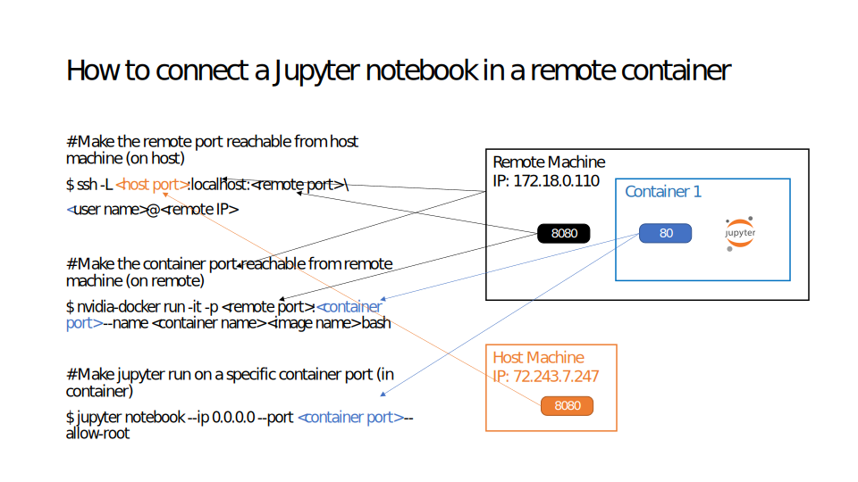

# container-networking

## How to connect a Jupyter notebook in a remote container
Think of a scenario where one is tasked to build a docker container on the remote server with jupyter notebook installed. The user then needs to access that jupyter notebook from local machine for code developement. The following diagram shows how this is done.

